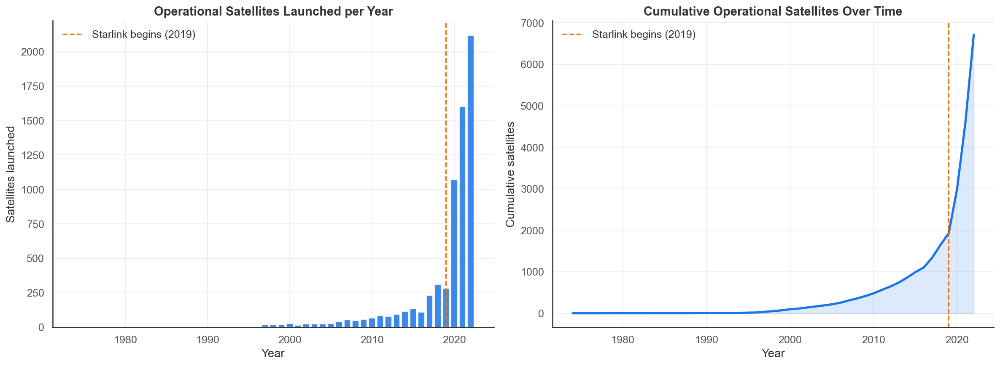
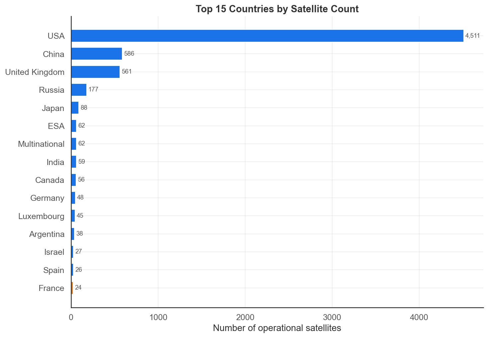
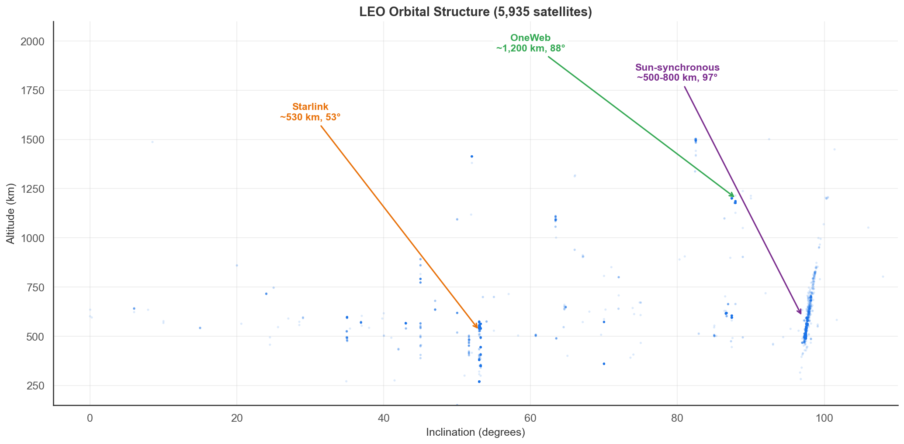
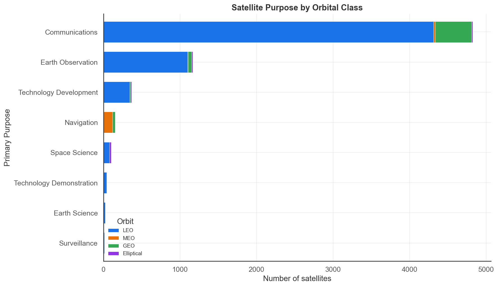
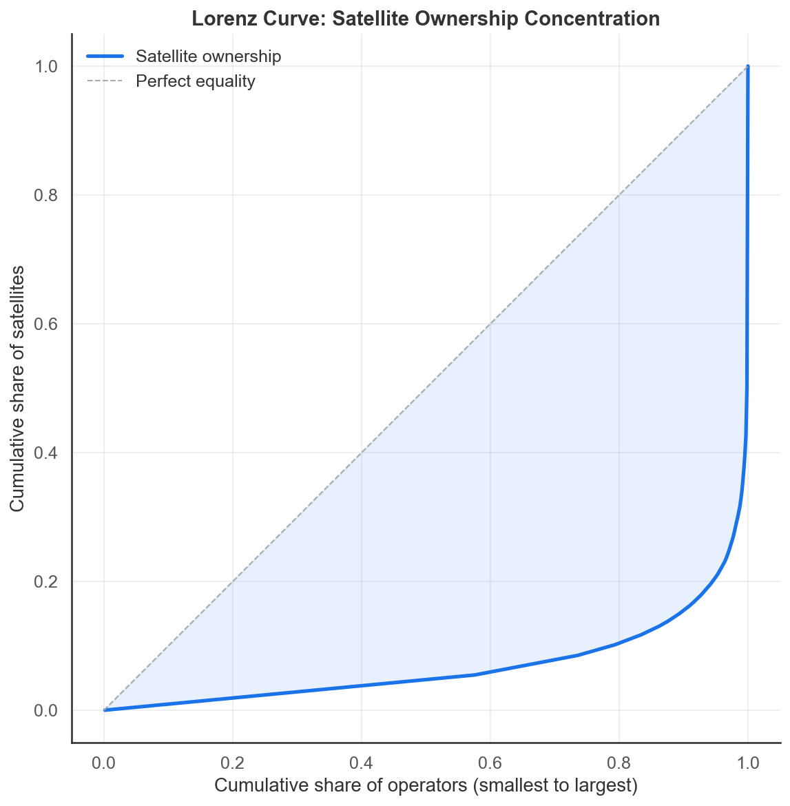

# Project of Data Visualization (COM-480)

| Student's name    | SCIPER |
| ----------------- | ------ |
| Kevin Abou Jaoude | 358300 |
| Youssef Dib       | 339964 |
| Mark Nabbout      | 358312 |
|                   |        |

[Milestone 1](#milestone-1) • [Milestone 2](#milestone-2) • [Milestone 3](#milestone-3)

## Milestone 1 (20th March, 5pm)

**10% of the final grade**

### Dataset

For this project, we use the Kaggle dataset [Every Known Satellite Orbiting Earth](https://www.kaggle.com/datasets/sujaykapadnis/every-known-satellite-orbiting-earth/data), and more specifically the file `UCS-Satellite-Database-Officialname-1-1-2023.csv`. This dataset is based on the UCS Satellite Database and contains detailed information about satellites currently orbiting Earth, including country of origin, operator, purpose, launch date, and important orbital parameters such as apogee, perigee, inclination, and orbital period. Each satellite entry includes a broad range of technical and mission-related fields, making it a strong basis for both analytical and visual exploration.

This dataset is particularly interesting because it combines multiple dimensions at once. It is not only a technical dataset about objects in space, but also a dataset about infrastructure, geopolitics, private versus public actors, and the evolution of orbital occupation over time. It allows us to study who owns satellites, what they are used for, which orbits are the most populated, and how the use of space has changed in recent decades.

The data appears structured and directly usable, although some preprocessing will be necessary. In particular, we expect to clean and harmonize country names, operator names, and purpose categories, as well as group orbital information into meaningful classes such as LEO (Low Earth Orbit, up to 2,000 km), MEO (Medium Earth Orbit, up to 35,786 km), and GEO (Geostationary Orbit, ~35,786 km). We may also derive some extra features such as launch decade, altitude bands, and broad mission families to make the future visualizations more intuitive.

One important strength of this dataset is that it already contains orbital descriptors. Even if it is not a real-time tracking dataset, it is still rich enough to support compelling interactive visualizations of orbital structure, orbital crowding, and the distribution of satellite activity around Earth.

### Problematic

When people think about space, they often imagine an empty and infinite environment. In reality, Earth's orbit is becoming an increasingly occupied and strategic space filled with communication, navigation, military, Earth observation, and scientific satellites. Our project aims to make this transformation visible by showing how orbital space has evolved and who is driving this change.

The central idea of Crowded Orbit is to reveal that Earth's orbit is no longer just a scientific frontier, but a hidden layer of modern infrastructure. Satellites shape communication, navigation, climate monitoring, security, and global connectivity, yet the general public rarely has a clear sense of how crowded this environment has become or how unequally it is controlled.

The project will revolve around several questions. How has the number of satellites evolved through time? Which countries and operators dominate orbital space? What are satellites primarily used for today? Which orbital layers are becoming the most densely occupied? How much of the recent growth comes from a small number of large constellations or operators?

Our goal is to answer these questions through an interactive and visually strong experience. Rather than building a technical simulator, we want to create an accessible narrative that combines visual discovery with exploration. A user could navigate a 3D globe or orbital shell representation, filter satellites by purpose or country, and follow a timeline showing how orbital congestion accelerated over time.

The target audience is broad. It includes students, technology enthusiasts, and non-specialists interested in understanding the infrastructures that power modern life. We believe this topic has strong potential because it combines science, politics, engineering, and visual appeal in a single project.

### Exploratory Data Analysis

Our EDA notebook preprocesses the UCS Satellite Database (6,718 satellites, 27 attributes) using Python and pandas. We cleaned orbit labels, parsed dates and numeric fields, derived features like altitude and launch year, and dropped three columns with over 80% missing values. The remaining fields have near-complete coverage.

The results directly support our narrative. Orbital space is filling fast: 75.5% of all operational satellites were launched from 2019 onward. It is also filling unevenly: the USA operates 67.1% of all satellites, and a single operator controls 49.9%. The Gini coefficient across 639 operators is 0.862, confirming extreme concentration.

LEO holds 88.4% of all satellites, making it the focal point of orbital congestion. Communications alone accounts for 71.8%, driven by mega-constellations like Starlink. Cross-dimensional analysis shows that purpose and orbit are tightly coupled: navigation clusters in MEO, Earth observation stays in LEO, and traditional communications sits in GEO.

These findings shape our visualization around three axes: how fast orbit filled up, who controls it, and where the congestion concentrates.

  

  
  

  
  

The full notebook with all plots is available in [`eda.ipynb`](eda.ipynb).

### Related work

Several notable projects have visualized satellite data, but they differ from our approach in scope and intent.

The most direct use of the UCS Satellite Database is the Quartz interactive "The World Above Us" (2014), which displays every active satellite sized by launch mass in altitude bands, with filtering by user type and purpose. While visually effective, it predates the mega-constellation era and contains no temporal narrative about how orbital space filled up.

Real-time 3D trackers form another category. [Stuff in Space](https://stuffin-space.vader.zone/) (James Yoder) is a WebGL globe color-coding satellites, rocket bodies, and debris using [Space-Track.org](http://Space-Track.org) data. [LeoLabs](https://leolabs-space.medium.com/earths-orbital-hot-spots-b6c8d57cd366) offers a professional LEO visualization platform tracking over 14,000 objects with filtering by country and altitude. Both are impressive monitoring tools but focus on where objects are now rather than explaining how space became crowded or who controls it.

[Our World in Data](https://ourworldindata.org/space-exploration-satellites) published a topic page on space exploration and satellites (Mathieu, Rosado, Roser, 2022) with static charts on payloads by orbit and launches over time. These are useful reference visualizations but lack interactivity and storytelling structure.

Our approach is original in combining temporal storytelling with interactive exploration. Rather than a dashboard or live tracker, we plan a scrollytelling experience guiding users through the transformation of orbital space from the 1970s to today, progressively revealing the roles of countries, operators, purposes, and mega-constellations, before opening into free exploration.

Our design inspirations come from outside the satellite domain. The Pudding's visual essays, with their scroll-driven progressive data reveals, directly inform our pacing. The NYT's scrollytelling on climate and infrastructure shows how editorial guidance makes dense data accessible. We aim to bring this narrative quality to satellite data, where it has not yet been applied.

None of us have used this dataset in a previous course.

## Milestone 2 (17th April, 5pm)

**10% of the final grade**

## Milestone 3 (29th May, 5pm)

**80% of the final grade**

## Late policy

- < 24h: 80% of the grade for the milestone
- < 48h: 70% of the grade for the milestone
