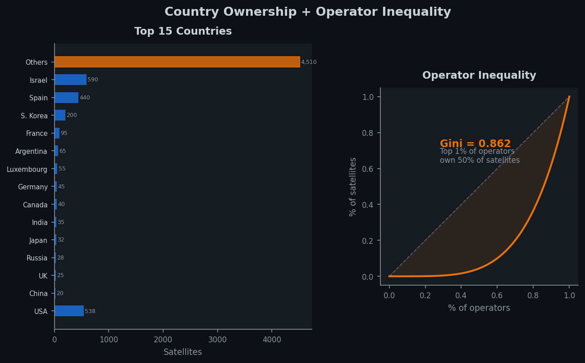
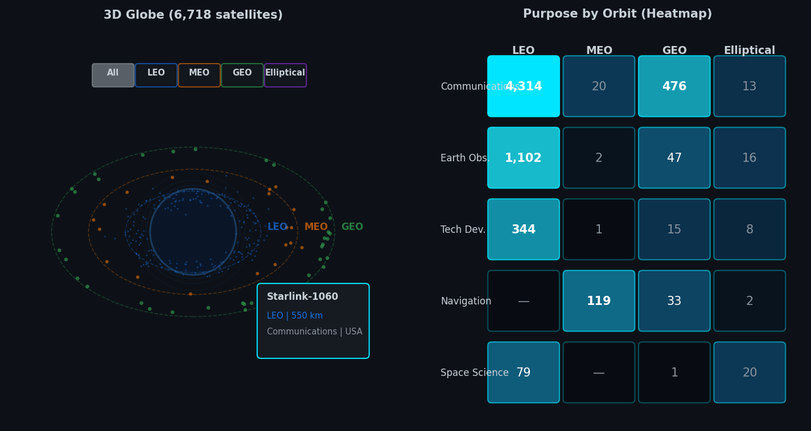

# Milestone 2: Crowded Orbit

**COM-480 Data Visualization, EPFL 2026**

Kevin Abou Jaoude, Youssef Dib, Mark Nabbout

## Project Goal

**Crowded Orbit** is a scrollytelling data visualization that reveals how Earth's orbit transformed from a near-empty scientific frontier into a crowded, unequally controlled infrastructure. The user scrolls through a guided three-chapter narrative: _The Explosion_ (how fast orbit filled up), _Who Owns Space?_ (geopolitical and corporate concentration), and _Where Is the Congestion?_ (orbital and purpose distribution), before being invited to freely explore a 3D interactive globe of all 6,718 operational satellites.

The narrative follows a structure inspired by Freytag's pyramid (Lecture 12, Storytelling):

- **Exposition**: The hero section sets the scene with 6,718 objects orbiting Earth.
- **Rising action**: The timeline chart progressively reveals decades of slow growth, then the sudden vertical takeoff post-2019.
- **Climax**: The country and operator analysis reveals that a single company (SpaceX) controls nearly 50% of all satellites, with a Gini coefficient of 0.862.
- **Falling action**: The orbital and purpose breakdown explains _where_ the congestion sits (88.4% in LEO) and _why_ (71.8% Communications, driven by mega-constellations).
- **Resolution**: The 3D globe lets users explore all satellites freely, filtering by orbit class and hovering for details.

## Functional Prototype

The prototype is available in the [`prototype/`](../../prototype/) folder and is deployed at [https://com-480-data-visualization.github.io/The-Outliers/](https://com-480-data-visualization.github.io/The-Outliers/). It includes all MVP components listed above, fully implemented with real data (not placeholders). The site loads two JSON data files: `satellites.json` (aggregated statistics for all charts) and `satellites-globe.json` (6,718 individual satellite records for the 3D globe).

## Visualization Sketches

**Section 1: Scrollytelling Cumulative Timeline.**
A scroll-driven area chart paired with a narrative column. Five annotated steps (1974 → 1998 → 2018 → 2021 → 2023) progressively reveal the chart via animated clip-path. Area chart was chosen over bars to convey cumulative weight; scroll-paced reveal lets readers feel the acceleration (L12). Left-text / right-chart layout follows The Pudding's scrollytelling convention.

**Section 2: Country Ownership + Operator Inequality.**
A horizontal bar chart shows the top 15 countries by satellite count, with the USA highlighted in orange (67.1% of all satellites). Horizontal bars were chosen over vertical to keep long country names readable (L7). Next to it, a Lorenz curve visualizes operator concentration with a Gini coefficient of 0.862, showing that the top 1% of operators own roughly half of all satellites.

**Section 3: 3D Globe + Purpose by Orbit Heatmap.**
A 3D interactive globe (Globe.gl) renders all 6,718 satellites as color-coded points by orbit class. Users can drag to rotate, scroll to zoom, and filter by LEO/MEO/GEO/Elliptical. Hovering a satellite shows its name, altitude, purpose, and country. Below, a log-scaled heatmap cross-references purpose × orbit class, revealing that Communications dominates LEO while Navigation clusters in MEO (L6).

**Page flow:** Hero (particle animation + counter) → Chapter 1 (scrollytelling timeline) → Chapter 2 (countries + Lorenz) → Chapter 3 (orbit donut + purpose bars + heatmap + 3D globe) → Stats bar (animated counters) → Footer.

## Tools and Relevant Lectures

| Visualization                                               | Tools                                                      | Relevant Lectures                                         |
| ----------------------------------------------------------- | ---------------------------------------------------------- | --------------------------------------------------------- |
| Website structure, layout, responsive design                | HTML5, CSS3 (Grid, Flexbox, custom properties)             | Lecture 1 (Web Development)                               |
| All D3 charts (bindData, scales, axes, transitions, shapes) | **D3.js v7**                                               | Lecture 4 (D3.js), Lectures 2–3 (JavaScript)              |
| Scrollytelling (step activation, progressive reveal)        | Native IntersectionObserver API, CSS transitions           | Lecture 5 (Interaction, Views), Lecture 12 (Storytelling) |
| Hover tooltips, filter buttons, animated counters           | D3 event listeners, DOM manipulation                       | Lecture 5 (Interaction)                                   |
| Color-coding orbits and purposes, donut inner label         | D3 scaleOrdinal, perceptually distinct palette             | Lecture 6 (Perception & Colors, Mark & Channel)           |
| Horizontal bar charts, chart type selection                 | Encoding effectiveness ranking (position > length > color) | Lecture 7 (Designing Viz, Do's and Don'ts)                |
| 3D interactive globe with satellite positions               | Globe.gl (built on Three.js), logarithmic altitude scale   | Lecture 8 (Maps, Practical Maps)                          |
| Lorenz curve (inequality), Gini annotation                  | D3 area, line generators                                   | Lecture 6 (Mark & Channel), Lecture 11 (Tabular Data)     |
| Narrative pacing, scroll-driven tension                     | Freytag's pyramid adapted for data                         | Lecture 12 (Storytelling)                                 |

**Additional tools:** Google Fonts (Space Grotesk + Inter), pre-aggregated JSON data exported from the EDA notebook (6,718 satellite records for the globe, aggregated statistics for all charts).

## Core Visualization (MVP)

All components below are **already implemented** in the prototype:

- Scrollytelling framework with IntersectionObserver, sticky chart, and step-linked transitions
- Cumulative timeline (area + line) with clip-path reveal synced to 5 scroll steps and hover tooltips
- Country bar chart (top 10, USA highlighted) and Lorenz curve (Gini = 0.862)
- Orbit donut chart (center label "88.4% in LEO") and purpose bar chart (6 color-coded categories)
- Purpose × Orbit heatmap with log-scaled color encoding and hover info cards
- 3D interactive globe (Globe.gl, 6,718 satellites) with orbit-class filters, drag/zoom, hover details
- Dark space-themed responsive layout with animated stat counters

## Extra Ideas (can be dropped without losing the narrative)

These features would enhance the experience but are not required for the core story:

1. **Launch animation replay**: A "Play" button on the 3D globe that animates satellites appearing year by year, turning the project's core thesis into a cinematic sequence.
2. **Mega-constellation isolator**: A toggle that highlights only Starlink, only OneWeb, or all others across the globe and charts simultaneously. Non-selected elements fade out.
3. **Time slider on the globe**: A year-range slider that filters the globe to show only satellites launched in a given period, for manual temporal exploration.
4. **Collision risk density map**: A 2D heatmap of altitude × inclination showing where orbital shells are most dangerously crowded.
5. **Stacked area chart (purpose over time)**: An animated stacked area showing how Communications overtook all other purposes after 2019.
6. **Operator deep-dive panel**: Clicking an operator opens a detail panel with its launch timeline, orbit breakdown, purpose split, and fleet growth.
7. **Before/after snapshot (2010 vs 2023)**: A split-screen comparing the state of orbit in 2010 versus 2023, filtering the globe by launch year.
8. **Orbital shell cross-section**: A side-view diagram showing Earth with concentric LEO/MEO/GEO rings, satellite density rendered as particle clouds.
