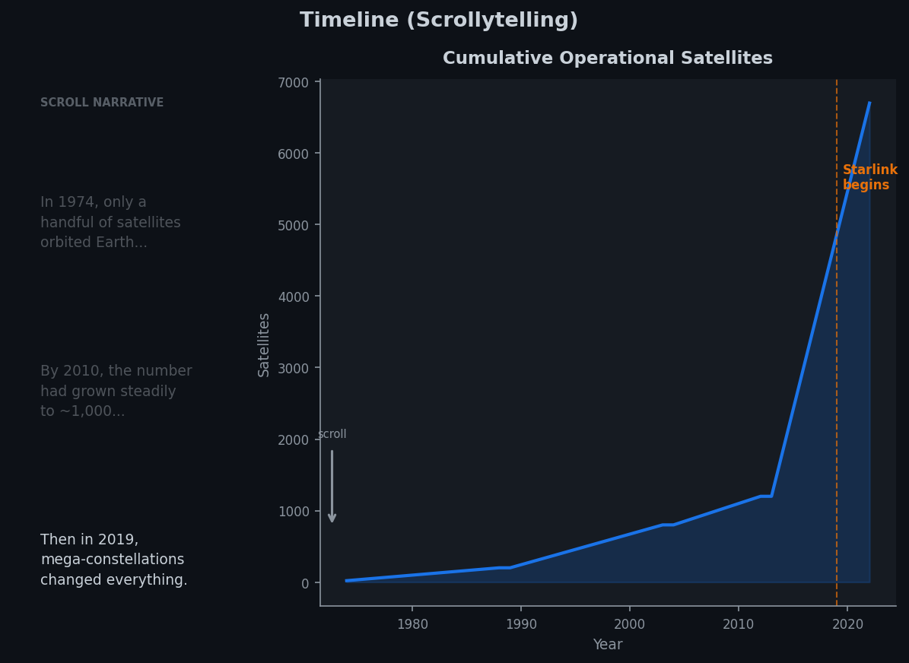
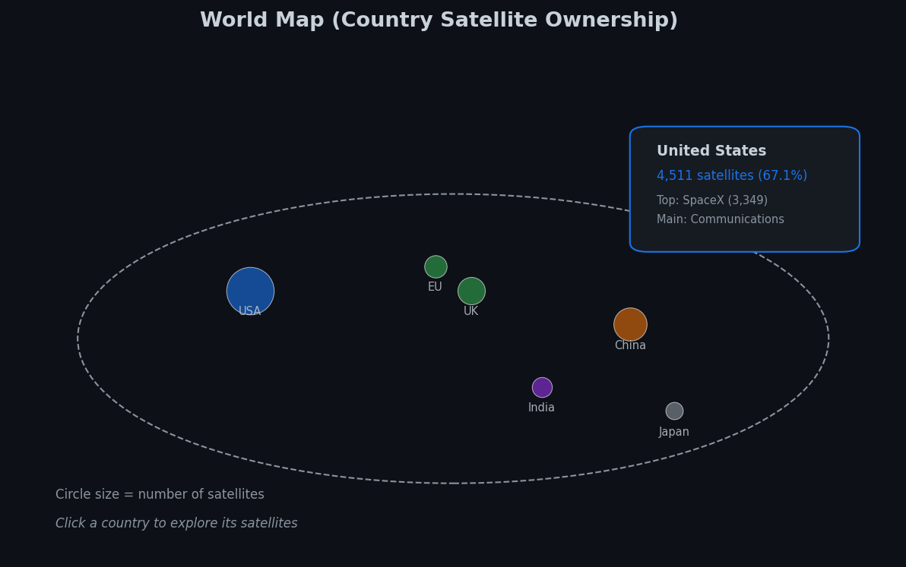
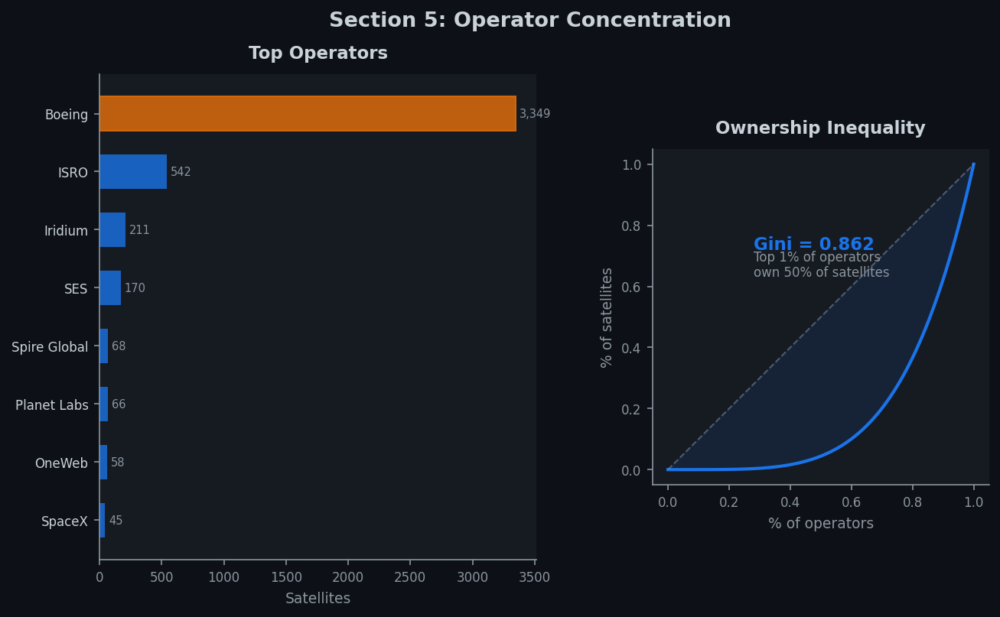
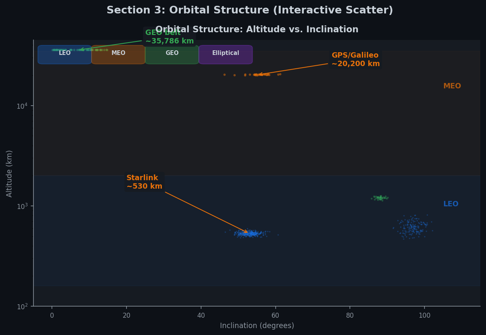
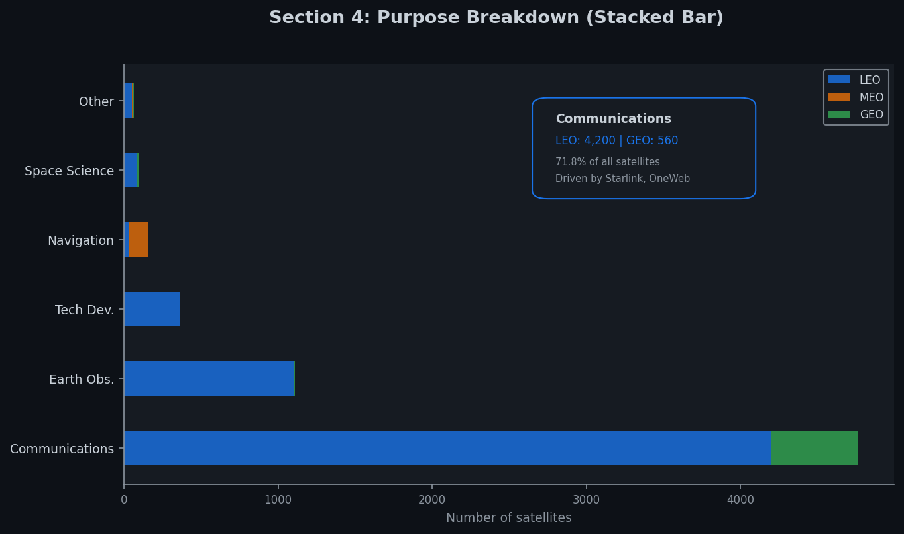

# Milestone 2 — Crowded Orbit

## Project Goal

**Crowded Orbit** is a scrollytelling data visualization that reveals how Earth's orbit transformed from a near-empty scientific frontier into a crowded, unequally controlled infrastructure. The user scrolls through a guided three-chapter narrative — *The Explosion* (how fast orbit filled up), *Who Owns Space?* (geopolitical and corporate concentration), and *Where Is the Congestion?* (orbital and purpose distribution) — before being invited to freely explore a 3D interactive globe of all 6,718 operational satellites.

The narrative follows a structure inspired by Freytag's pyramid (Lecture 12 — Storytelling):
- **Exposition** — The hero section sets the scene: 6,718 objects orbit Earth.
- **Rising action** — The timeline chart progressively reveals decades of slow growth, then the sudden vertical takeoff post-2019.
- **Climax** — The country and operator analysis reveals that a single company (SpaceX) controls nearly 50% of all satellites, with a Gini coefficient of 0.862.
- **Falling action** — The orbital and purpose breakdown explains *where* the congestion sits (88.4% in LEO) and *why* (71.8% Communications, driven by mega-constellations).
- **Resolution** — The 3D globe lets users explore all satellites freely, filtering by orbit class and hovering for details.

## Visualization Sketches

### Section 1 — Scrollytelling Cumulative Timeline

A scroll-driven area chart paired with a narrative column. As the user scrolls through five annotated steps (1974 → 1998 → 2018 → 2021 → 2023), the chart progressively reveals via an animated clip-path. A tracking marker and label highlight the current data point.

**Design choices:** Area chart (not bar) because the cumulative nature of the data emphasizes magnitude over individual years. The scroll-driven reveal builds tension gradually — the reader *experiences* the acceleration rather than seeing it all at once (Lecture 12 — Storytelling). The left-text / right-chart layout follows The Pudding's scrollytelling convention.



### Section 2 — Country Ownership + Operator Inequality

Two paired visualizations. **Left:** a horizontal bar chart of the top 10 countries by satellite count, with the USA highlighted in a contrasting color to emphasize its 67.1% dominance. **Right:** a Lorenz curve plotting cumulative operator share vs. cumulative satellite share, with the shaded area representing inequality (Gini = 0.862).

**Design choices:** Horizontal bars rather than vertical because country names are long categorical labels — vertical bars would require angled text, which reduces readability (Lecture 7 — Do's and Don'ts of Viz). The Lorenz curve is paired with the bar chart so the user sees both *national* and *corporate* concentration side by side, reinforcing the inequality message.




### Section 3 — Orbital Structure + Purpose Breakdown + 3D Globe

Three sub-visualizations. **A donut chart** showing orbit class distribution (LEO 88.4%, GEO 8.4%, MEO 2.2%, Elliptical 1.1%), with the center label "88.4% in LEO" acting as an anchor. **A horizontal bar chart** of satellite purposes, color-coded by function. **A heatmap** cross-referencing purpose × orbit class, revealing that Communications dominates LEO, Navigation clusters in MEO, and traditional broadcast sits in GEO.

Below these, a **3D interactive globe** (Globe.gl / Three.js) renders all 6,718 individual satellites as color-coded points. Users can drag to rotate, scroll to zoom, and click filter buttons (All / LEO / MEO / GEO / Elliptical) to isolate orbit classes. Hovering a point shows satellite name, country, altitude, and purpose.

**Design choices:** The donut chart uses an inner label instead of a separate legend — the single most important number (88.4%) is readable at a glance (Lecture 6 — Perception and Marks/Channels). The purpose × orbit heatmap uses a log-scaled sequential color encoding (`d3.scaleSequentialLog`) to handle the wide range of values (from 1 to 4,000+) across purpose × orbit combinations, making patterns immediately visible without the clutter of many small bars (Lecture 6 — Perception and Marks/Channels). The 3D globe uses logarithmic altitude scaling so LEO and GEO satellites are both visible without GEO dwarfing the scene.




### Page Flow

The full scroll journey is: **Hero** (particle animation + counter) → **Chapter 1** (scrollytelling timeline) → **Chapter 2** (countries + Lorenz) → **Chapter 3** (orbit donut + purpose bars + heatmap + 3D globe) → **Stats bar** (animated counters) → **Footer**. Each chapter begins with a header (chapter number, title, one-sentence insight) that sets context before the visualization appears.

## Tools and Relevant Lectures

| Visualization | Tools | Relevant Lectures |
|---|---|---|
| Website structure, layout, responsive design | HTML5, CSS3 (Grid, Flexbox, custom properties) | Lecture 1 (Web Development) |
| All D3 charts (bindData, scales, axes, transitions, shapes) | **D3.js v7** | Lecture 4 (D3.js), Lectures 2–3 (JavaScript) |
| Scrollytelling (step activation, progressive reveal) | Native IntersectionObserver API, CSS transitions | Lecture 5 (Interaction, Views), Lecture 12 (Storytelling) |
| Hover tooltips, filter buttons, animated counters | D3 event listeners, DOM manipulation | Lecture 5 (Interaction) |
| Color-coding orbits and purposes, donut inner label | D3 scaleOrdinal, perceptually distinct palette | Lecture 6 (Perception & Colors, Mark & Channel) |
| Horizontal bar charts, chart type selection | Encoding effectiveness ranking (position > length > color) | Lecture 7 (Designing Viz, Do's and Don'ts) |
| 3D interactive globe with satellite positions | Globe.gl (built on Three.js), logarithmic altitude scale | Lecture 8 (Maps, Practical Maps) |
| Lorenz curve (inequality), Gini annotation | D3 area, line generators | Lecture 6 (Mark & Channel), Lecture 11 (Tabular Data) |
| Narrative pacing, scroll-driven tension | Freytag's pyramid adapted for data | Lecture 12 (Storytelling) |

**Additional tools:** Google Fonts (Space Grotesk + Inter for typographic hierarchy), pre-aggregated JSON data exported from the EDA notebook (6,718 satellite records for the globe, aggregated statistics for all charts).

## Core Visualization (MVP)

These components form the minimal viable product required for Milestone 3. All are **already implemented** in the prototype:

1. **Scrollytelling framework** — IntersectionObserver-based scroll triggers with step activation, sticky chart, text-opacity transitions, and custom events linking narrative to visualization.
2. **Cumulative timeline chart** — Area + line chart with animated clip-path reveal synced to 5 scroll steps, hover tooltip with year/count, and orange marker tracking the current data point.
3. **Country bar chart** — Top 10 horizontal bars with staggered animation, USA highlighted, interactive tooltips.
4. **Lorenz curve** — Operator inequality visualization with equality-line reference, shaded Gini area, and annotated coefficient (0.862).
5. **Orbit donut chart** — Four-segment donut with hover expansion, center "88.4% in LEO" label, and color-coded legend.
6. **Purpose bar chart** — Six categories with color-coded bars, percentage labels, and tooltips.
7. **Purpose × Orbit heatmap** — Log-scaled color-encoded heatmap showing which purposes cluster in which orbits, with hover info cards displaying exact counts.
8. **3D interactive globe** — Globe.gl rendering of 6,718 satellites, with drag-to-rotate, zoom, orbit-class filter buttons, and hover tooltips showing satellite details.
9. **Dark space-themed layout** — Responsive CSS Grid/Flexbox layout with consistent color palette, scroll indicator, and animated stat counters.

## Extra Ideas (can be dropped without losing the narrative)

These features would enhance the experience but are not required for the core story:

1. **Launch animation replay** — A "play" button on the 3D globe that animates satellites appearing year by year, letting the user watch orbit go from near-empty to packed in a cinematic sequence. Builds directly on the existing globe and year data to turn the project's core thesis into a visceral experience.
2. **Mega-constellation isolator** — A toggle that highlights only Starlink, only OneWeb, or all others across the globe and charts simultaneously. Non-selected satellites and bars fade out, making the "one operator controls ~50%" statistic tangible through linked cross-view highlighting.
3. **Time slider on the globe** — A year-range slider that filters the globe to show only satellites launched in a given period, letting users manually explore how orbit filled up in 3D. Complements the launch animation by offering free exploration after the guided moment.
4. **Collision risk density map** — A 2D heatmap of altitude × inclination showing where orbital shells are most dangerously crowded, adding a "so what?" layer to the congestion narrative. Uses existing orbital parameters from the dataset.
5. **Stacked area chart (purpose over time)** — An animated stacked area showing how Communications overtook all other purposes after 2019, reinforcing the mega-constellation narrative with a temporal dimension.
6. **Operator deep-dive panel** — Clicking an operator name (e.g., SpaceX) opens a detail panel with its launch timeline, orbit breakdown, purpose split, and fleet growth. Adds a drill-down layer to the concentration narrative.
7. **Before/after snapshot (2010 vs 2023)** — A split-screen or toggle comparing the state of orbit in 2010 versus 2023, filtering the globe by launch year. Simple to implement but immediately powerful as a standalone storytelling moment.
8. **Animated orbital shell cross-section** — A side-view diagram showing Earth with concentric rings for LEO/MEO/GEO, satellite density rendered as particle clouds, conveying the physical "crowdedness" of each shell.

## Functional Prototype

The prototype is available in the [`website/`](../../website/) folder. It includes all MVP components listed above, fully implemented with real data (not placeholders). The site loads two JSON data files: `satellites.json` (aggregated statistics for all charts) and `satellites-globe.json` (6,718 individual satellite records for the 3D globe).

To run locally:

```bash
cd website
python -m http.server 8080
```

Then open [http://localhost:8080](http://localhost:8080).
